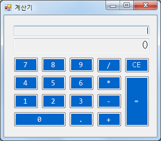

## CsCalculator

### 개요
* Visual Studio C# 으로 구현한 간단한 계산기입니다.

### 설명
* Windows 기본 계산기 프로그램 디자인을 참고하였습니다.
* 정수, 실수 단위의 계산이 가능합니다.
* 계산 과정 칸과 결과 칸이 각각 존재합니다.
* 서로 다른 연산 부호를 반복적으로 입력할 시 계산 과정 칸의 부호가 바뀌는 것을 볼 수 있습니다.
* 마우스 클릭으로 동작하며, 키보드 입력도 곧 지원할 예정입니다.

### 기술
* C#
* GitHub Desktop, GitHub

### 미리보기

